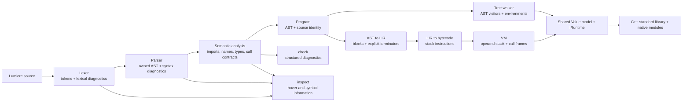
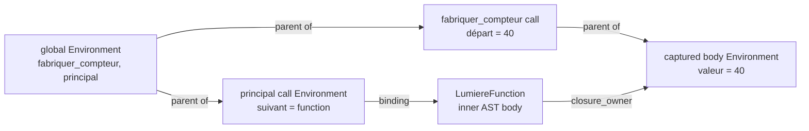
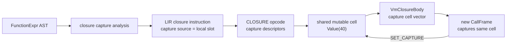
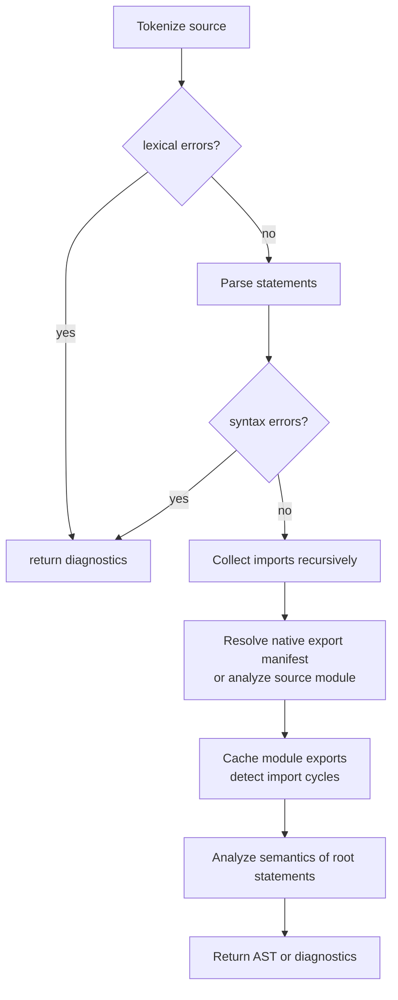
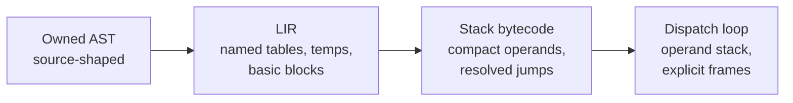
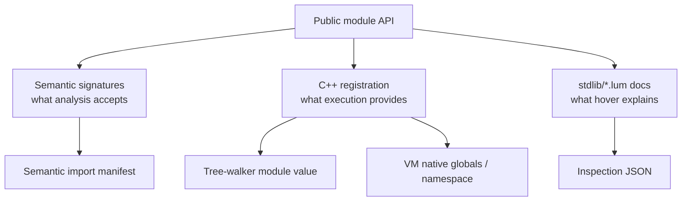
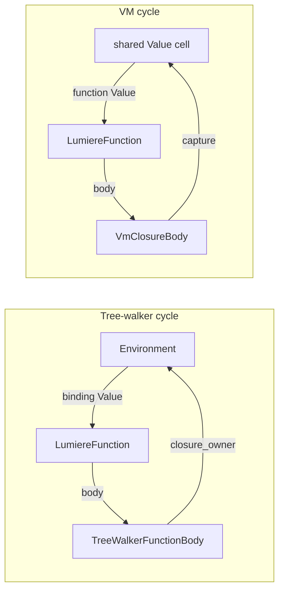
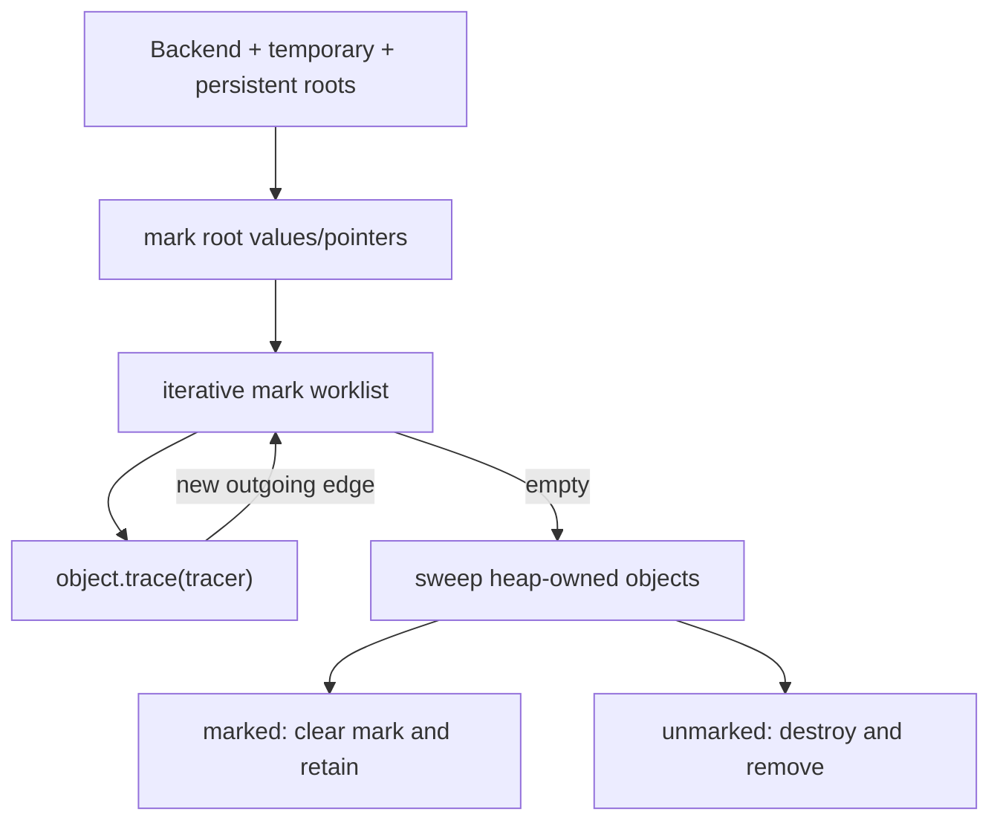
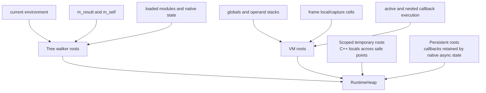

# Understanding Lumiere

This is the repository-level mental model for Lumiere: what happens to a source
file, where each responsibility lives, how the two execution engines differ,
where runtime objects are owned, and what must be understood before replacing
reference counting with a garbage collector.

It is written against the current implementation. When this handbook and an
older design note disagree, trust the source and tests first, then this handbook.
In particular, some older notes predate the semantic analyzer or describe the VM
as future work. Both exist today, and the bytecode VM is the default file backend.

## How to use this handbook

Read it in three passes:

1. Read **The interview answer**, **The system in one diagram**, and **Repository
   map**. You should then be able to explain the project without reciting files.
2. Trace the example through the front end, tree walker, and VM. This builds a
   causal model rather than a vocabulary list.
3. Study **Runtime ownership today** and **Before implementing GC**. Those are the
   parts that determine whether a collector is correct.

The detailed language surface remains in [the language specification](lumiere_spec.md).
This document explains implementation mechanics.

## Contents

- [The interview answer](#the-interview-answer)
- [The system in one diagram](#the-system-in-one-diagram)
- [Repository map](#repository-map)
- [One program, end to end](#one-program-end-to-end)
- [Application and CLI lifecycle](#application-and-cli-lifecycle)
- [The shared front end](#the-shared-front-end)
- [Backend boundary and semantic authority](#backend-boundary-and-semantic-authority)
- [Runtime value model](#runtime-value-model)
- [Tree-walker execution engine](#tree-walker-execution-engine)
- [VM compiler and execution engine](#vm-compiler-and-execution-engine)
- [Modules and standard library](#modules-and-standard-library-three-views-of-one-api)
- [Diagnostics, inspection, and hover](#diagnostics-inspection-and-hover-documentation)
- [Testing and feature workflow](#testing-strategy)
- [Runtime ownership today](#runtime-ownership-today)
- [Before implementing GC](#before-implementing-gc)
- [Current design tensions](#current-design-tensions-and-debt)
- [Debugging recipes](#debugging-recipes)
- [Study plan](#study-plan-for-interview-level-familiarity)
- [Interview questions](#interview-questions-you-should-be-able-to-answer)
- [Glossary](#glossary)
- [Source-reading index](#source-reading-index)

## The interview answer

### Thirty seconds

Lumiere is a C++20 implementation of a statically analyzed programming language.
A shared front end tokenizes source, builds an owned AST, resolves imports and
types, and reports structured diagnostics. Valid programs can run through either
a direct tree-walking interpreter or a compiler pipeline that lowers the AST to a
block-based IR, then stack bytecode, then executes it in an explicit-frame VM.
Both backends use the same runtime value model and native standard library through
an `IRuntime` boundary. The next major runtime change is replacing `shared_ptr`
ownership with a precise, non-moving mark-and-sweep collector because closures,
environments, capture cells, containers, and objects can form cycles.

### Two minutes

The executable in [`src/lumiere.cpp`](src/lumiere.cpp) handles file execution,
the REPL, static checking, editor inspection, IR dumps, bytecode disassembly, and
LumiTest discovery. All source-based paths converge on `analyze_source` in
[`src/analysis/analysis.cpp`](src/analysis/analysis.cpp). That orchestration
layer runs the lexer, recursive-descent parser, recursive module analysis, and
semantic analyzer. The result is an AST made of `unique_ptr` nodes plus structured
diagnostics.

For execution, the AST is wrapped in a `Program` and sent through the very small
`Backend` interface. The tree walker implements AST visitors and evaluates nodes
directly while maintaining a lexical chain of `Environment` objects. A function
captures the environment where it was created. The VM instead lowers the AST to
non-SSA, three-address-like LIR with explicit basic-block terminators, converts
that LIR to stack bytecode, and runs bytecode with an operand stack and explicit
`CallFrame` vector. VM closures capture shared mutable cells rather than copied
values, which preserves mutation semantics.

Both engines exchange the same `Value` representation with standard-library
code. `Value` stores primitives inline and reference values behind `shared_ptr`.
`IRuntime` lets native code call Lumiere functions, raise backend-aware errors,
compare and stringify values, and attach runtime type metadata without depending
on either interpreter. Modules have three related representations: semantic
export manifests, runtime/native registrations, and VM-linked namespaces.

The largest architectural risk is lifetime. Reference counting cannot reclaim
legal cycles such as `Environment -> function -> closure Environment` or
`capture cell -> function -> closure body -> capture cell`. The planned collector
therefore needs one heap, explicit trace edges, complete roots for each backend,
temporary roots for C++ locals, persistent roots for asynchronous native work,
and collection only at audited safe points.

## The system in one diagram



The central design decision is not “two separate interpreters.” It is **one
language front end and runtime contract with two execution strategies**.

## Repository map

| Area | Main location | Responsibility |
| --- | --- | --- |
| CLI and application modes | [`src/lumiere.cpp`](src/lumiere.cpp) | Selects analysis, tooling, REPL, tests, or a backend |
| Source coordinates | [`include/lumiere/source_file.hpp`](include/lumiere/source_file.hpp), [`include/lumiere/diagnostics`](include/lumiere/diagnostics) | Paths, spans, severities, human and JSON diagnostics |
| Lexing | [`include/lumiere/lexer`](include/lumiere/lexer), [`src/lexer`](src/lexer) | Characters to tokens, including comments and documentation |
| Parsing and AST | [`include/lumiere/parser`](include/lumiere/parser), [`src/parser`](src/parser) | Tokens to owned syntax tree and type syntax |
| Semantic analysis | [`include/lumiere/analysis`](include/lumiere/analysis), [`src/analysis`](src/analysis) | Imports, declarations, scopes, types, signatures, expression types |
| Shared runtime | [`include/lumiere/interpreter/runtime`](include/lumiere/interpreter/runtime) | `Value`, call bundles, runtime services, errors |
| Backend seam | [`include/lumiere/interpreter/iinterpreter.hpp`](include/lumiere/interpreter/iinterpreter.hpp) | `Backend::execute(Program&)` |
| Tree walker | [`include/lumiere/interpreter/tree_walker`](include/lumiere/interpreter/tree_walker), [`src/interpreter/tree_walker`](src/interpreter/tree_walker) | Direct AST evaluation and lexical environments |
| VM compiler | [`include/lumiere/interpreter/vm`](include/lumiere/interpreter/vm), [`src/interpreter/vm`](src/interpreter/vm) | AST-to-LIR, linking, bytecode emission, VM execution |
| Standard library | [`include/lumiere/interpreter/stdlib`](include/lumiere/interpreter/stdlib), [`src/interpreter/stdlib`](src/interpreter/stdlib), [`stdlib`](stdlib) | Native behavior, module registration, public hover documentation |
| Tests | [`tests`](tests) | Layer tests, backend parity, fixtures, CLI behavior |
| Design notes | [`docs`](docs/) | Current and historical subsystem explanations |

### The five artifacts to keep distinct

1. **Tokens** preserve lexical kind, lexeme, and source range.
2. **AST nodes** describe source structure and own child nodes.
3. **Semantic types/model** describe resolved meaning; they are not runtime
   values.
4. **LIR and bytecode** describe VM execution; the tree walker never needs them.
5. **Runtime `Value`s** are the data manipulated while a program runs.

Many compiler explanations become confused by treating all five as “the parsed
program.” They exist at different phases and have different lifetimes.

## One program, end to end

Consider a closure:

```lumiere
fonction fabriquer_compteur(départ: Entier) {
    soit valeur = départ
    retourne fonction() -> Entier {
        valeur = valeur + 1
        retourne valeur
    }
}

fonction principal() {
    soit suivant = fabriquer_compteur(40)
    afficher(suivant())
}
```

### Front-end trace

1. The lexer recognizes keywords, identifiers, punctuation, literals, operators,
   and source positions. Whitespace and ordinary comments do not become syntax
   nodes. A `/** ... */` comment is retained as documentation for a following
   declaration.
2. The parser recognizes two `FunctionDeclStmt`s. The inner anonymous function
   becomes a `FunctionExpr`; assignments and returns become their corresponding
   AST nodes. Child ownership is `unique_ptr`, so destroying the root statement
   list destroys the tree.
3. Semantic analysis first makes declarations and callable signatures available,
   then resolves bodies. It establishes that `départ` and `valeur` are integer
   values, that the anonymous function returns `Entier`, and that calls obey known
   signatures. The semantic model associates resolved types with AST expression
   addresses.
4. The AST and source text are moved into `Program`. Runtime function bodies may
   refer back to AST nodes, so that `Program` must remain alive while those
   functions can execute.

### Tree-walker trace



The function value holds a tree-walker-specific function body containing raw AST
pointers and an owning pointer to the captured environment. Calling `suivant`
creates another call environment whose parent is that closure. `valeur` is found
by walking the parent chain, and assignment updates the first binding found.

This directly explains lexical scope. It also exposes a reference cycle if the
captured environment itself binds the function.

### VM trace



The compiler discovers that `valeur` is free in the inner function and records a
capture. At runtime, locals and captures are `shared_ptr<Value>` cells. The
closure and future frames share the same cell, so `SET_CAPTURE` mutates the
lexical variable rather than a copy.

The same program therefore has two different execution representations but the
same observable closure semantics.

## Application and CLI lifecycle

[`src/lumiere.cpp`](src/lumiere.cpp) is composition code, not language
semantics. Its important paths are:

| Command | Pipeline | Notes |
| --- | --- | --- |
| `lumiere file.lum` | analyze -> compile -> VM | VM is the default |
| `lumiere --vm file.lum` | analyze -> compile -> VM | Explicit default backend |
| `lumiere --tw file.lum` | analyze -> tree walker | Useful as the direct/reference implementation |
| `lumiere` | repeated analyze -> tree walker incremental execution | Keeps AST submissions and global state alive |
| `lumiere check ...` | analyze -> diagnostics | Text or JSON; no execution |
| `lumiere inspect ...` | inspect source at byte offset -> JSON | Editor hover/symbol protocol |
| `lumiere ir file.lum` | analyze -> linked LIR printer | Compiler inspection |
| `lumiere bytecode file.lum` | analyze -> compile -> disassembler | Encoded execution inspection |
| `lumiere tester ...` | discover `_test.lum` -> analyze -> tree walker | LumiTest runner currently uses the tree walker |

`parse_program` is an important gate: backends receive a program only after the
shared analysis pipeline reports no errors. Backend runtime checks still matter
for dynamic values, native boundaries, casts, and state mutations.

The REPL stores every submitted `Program` in a vector. This is not incidental:
tree-walker function bodies contain raw pointers into those ASTs. Retaining each
submission prevents closures declared in an earlier submission from pointing at
destroyed syntax.

## The shared front end

### Lexer

The lexer is responsible for **lexical truth** only:

- recognizing keywords, identifiers, numeric/text/symbol literals and operators;
- recording ranges for diagnostics and inspection;
- handling malformed characters and literals;
- distinguishing ordinary comments from declaration documentation.

It must not decide whether a name exists or whether an operand has the right
type. Those depend on scopes and declarations and belong to semantic analysis.

Lumiere declaration documentation uses the conventional form:

```lumiere
/**
 * Calcule la somme de deux entiers.
 *
 * @param gauche Premier terme.
 * @param droite Second terme.
 * @return La somme des deux termes.
 */
fonction additionner(gauche: Entier, droite: Entier) -> Entier {
    retourne gauche + droite
}
```

Ordinary `//` and `/* ... */` comments remain ordinary comments. `///` is not a
second legacy documentation syntax. Inspection surfaces the attached declaration
documentation on hover.

### Parser and AST ownership

The parser is recursive descent: a function responsible for a grammar level
consumes tokens and returns an AST node. Expression functions encode precedence,
while statement/declaration functions recognize larger constructs. Parser error
recovery synchronizes at safe boundaries so one run can report more than one
syntax error.

The AST in [`include/lumiere/parser/ast.hpp`](include/lumiere/parser/ast.hpp)
uses `std::unique_ptr` for expressions and statements. This gives the syntax tree
a single, obvious owner and makes source structure explicit. Visitor interfaces
then separate operations from node storage:

- the tree walker implements expression and statement visitors;
- AST-to-LIR lowering implements another traversal;
- tooling may traverse without adding editor-specific methods to every node.

`TypeExpr` is syntax for a type annotation. `SemanticType` is the canonical,
resolved meaning of such syntax. A runtime `Value::Type` is a coarse runtime tag.
These three concepts must not be conflated.

### Analysis orchestration and imports

`analyze_source` in [`src/analysis/analysis.cpp`](src/analysis/analysis.cpp)
performs this sequence:



File imports are resolved relative to source context and recursively analyzed.
Native modules provide an analyzer-facing export manifest. The resulting
`SemanticImportEnvironment` gives the root analyzer the public names, types,
aliases, callable signatures, and error types visible from each import.

This is compile-time module work. Runtime module initialization is a separate
concern described later.

### Semantic analyzer

The semantic analyzer in
[`src/analysis/semantic_analysis.cpp`](src/analysis/semantic_analysis.cpp)
does more than a single left-to-right walk. At a high level it:

1. installs built-in and native callable contracts;
2. collects module-level declarations;
3. resolves imports and type aliases;
4. collects error types and resolves class constructors;
5. resolves function signatures and annotations before relying on bodies;
6. walks expressions and statements with lexical scopes and control-flow
   context;
7. records expression types, callable owners, declarations, and diagnostics.

Resolving signatures before bodies permits forward type references and calls to
known declarations that appear later in source.

The output `SemanticModel` contains interned type objects, module-level type and
value symbols, function/constructor signatures, return-statement owners, and
expression types keyed by AST node address. Type interning makes equal canonical
types share a representation and makes unions/generic types stable to compare.

Semantic analysis answers questions such as:

- Does this identifier resolve in the current scope?
- Is this return inside a callable, and is its type compatible?
- Does this call have a known callable shape and valid arguments?
- Does an imported member exist and is it public?
- Is a class/interface/type alias valid?
- What type should tooling display for this expression?

It cannot eliminate all runtime validation. Values from native code, dynamic
member access, casts, mutation of aliased containers, and actual call dispatch
still require runtime enforcement.

## Backend boundary and semantic authority

`Backend` deliberately exposes only `execute(Program&)`. The caller need not know
whether execution walks syntax or dispatches bytecode.

The authority hierarchy is:

1. The language specification defines intended observable behavior.
2. The shared lexer, parser, and semantic analyzer define accepted programs and
   backend-independent diagnostics.
3. Backend-parity and integration tests protect execution equivalence.
4. A backend's implementation strategy is not itself language semantics.

The tree walker is usually easiest to read when learning a feature because its
code follows AST structure. The VM is the default file execution backend and is
not merely an optimization stub. When behavior differs, fix the shared contract
or the incorrect backend and add a parity test; do not silently designate one
backend's accident as the language rule.

## Runtime value model

[`include/lumiere/interpreter/runtime/value.hpp`](include/lumiere/interpreter/runtime/value.hpp)
defines the common runtime universe.

| Value family | Current storage | Important outgoing edges |
| --- | --- | --- |
| `Entier`, `Décimal`, `Logique`, `Symbole`, `Texte` | Inline in `Value::Data` | None to managed language objects |
| `Rien` | Explicit tag, no matching variant alternative | None |
| `Liste`, `ListeFixe`, `Dictionnaire`, `Ensemble` | `shared_ptr` to collection data | Element/key/value `Value`s |
| `Objet` | `shared_ptr<LumiereObject>` | Class, native state, field `Value`s |
| `Fonction` | `shared_ptr<LumiereFunction>` | Body, bound receiver, opaque native captures |
| `Classe` | `shared_ptr<LumiereClass>` | Parent, interfaces, backend body |
| `Interface` | `shared_ptr<LumiereInterface>` | Backend body |
| `Résultat` | `shared_ptr<const ResultData>` | Payload and traceback metadata |

`Value` has an explicit `Type` enum and a `std::variant`. Their order is coupled,
which is why the header warns that they must remain in sync. `Rien` is represented
only by its tag; the default variant payload is irrelevant for that case.

### Runtime entities

- `LumiereFunction` represents native functions, user functions, and bound
  methods. A bound method carries its receiver.
- `RuntimeFunctionBody`, `RuntimeClassBody`, and `RuntimeInterfaceBody` are
  polymorphic extension points. Each backend stores its own execution data in a
  derived body.
- `LumiereObject` stores its class, fields, and optional opaque native state.
- `Module` stores members, public-name sets, type aliases, and backend/native
  state.
- `ResultData` stores success/failure, a payload, origin, and propagation trace.

The runtime graph can therefore be cyclic even if the AST is a tree.

### `IRuntime`: the native boundary

Native stdlib code should depend on
[`IRuntime`](include/lumiere/interpreter/runtime/iruntime.hpp), not on a
concrete backend. The interface supplies five language-level operations:

1. call a normalized callable;
2. raise a source-aware runtime error;
3. compare values with Lumiere equality;
4. convert a value using Lumiere formatting;
5. attach runtime type metadata.

`NativeArgs` carries the receiver, evaluated arguments, and call site. This keeps
argument evaluation and backend stack mechanics outside stdlib functions.

The most subtle operation is `call`: native code can call a Lumiere callback.
The tree walker re-enters AST evaluation; VM runtime services can re-enter
`run_frames`. GC root design must therefore cover values held across native
calls and nested backend execution.

## Tree-walker execution engine

`TreeWalker` simultaneously implements `Backend`, `IRuntime`, `ExprVisitor`, and
`StmtVisitor`. Its state includes:

- `m_result`, the scratch result of the most recent expression visitor;
- `m_env` and `m_env_owner`, the current lexical environment;
- `m_self`, the current `ici` receiver;
- module cache and loaded module AST ownership;
- source context and stack frames for errors;
- backend-side maps for generic collection constraints.

### Evaluation mechanics

`evaluate(expr)` dispatches the expression visitor and returns `m_result`.
Statement visitors instead perform effects or throw an internal control signal.
Returns, breaks, and continues unwind nested C++ calls until the intended
function or loop boundary catches them. `ScopeGuard` uses RAII to restore the
previous environment even during this unwinding.

An `Environment` is one lexical frame:

```text
name -> { Value, is_fixe, declared_type }
parent -> enclosing Environment
```

`get` and `assign` search toward the root. `define` touches only the current
frame. This distinction implements lexical shadowing and nearest-binding
assignment.

### Function call mechanics

For a user function, the tree walker:

1. evaluates arguments left to right and preserves optional names;
2. checks/binds them in a fresh call environment whose parent is the closure;
3. installs a bound receiver as `ici` when needed;
4. executes the saved AST body;
5. catches a return signal and restores environment/receiver through guards;
6. adds stack information if an error escapes.

The function body's raw pointers to its AST declaration/body are non-owning. The
owning `Program` or loaded module statement list must outlive every such function.

### Modules in the tree walker

A source module is parsed/analyzed before execution, then executed in its own
environment. The shared analysis phase validates the import graph first; the
tree-walker loader currently reads and parses the imported file again to obtain
the AST it executes. Public bindings become `Module::members`; the module state
retains the environment needed by exported closures. Loaded statement lists are
also retained for raw AST-pointer validity. A cache avoids repeated
initialization, and a loading set rejects cycles during active loading.

## VM compiler and execution engine

The VM path has three explicit transformations:



Each stage makes a different concern concrete. Skipping directly from AST to
bytecode would mix semantic lowering, control-flow construction, linking, and
binary encoding in one difficult-to-inspect step.

### LIR

The LIR in [`include/lumiere/interpreter/vm/lir.hpp`](include/lumiere/interpreter/vm/lir.hpp)
is block-based, three-address-like, and intentionally not SSA. Operands refer to
indexed tables for constants, globals, locals, temporaries, captures, functions,
blocks, types, members, classes, interfaces, argument names, and namespaces.

Every `LirBlock` has a straight-line instruction list followed by exactly one
explicit terminator: jump, conditional branch, return value, or return nil. There
is no implicit fallthrough. This invariant makes control flow printable and
validatable before byte encoding.

AST-to-LIR lowering is where high-level source shapes become explicit operations:

- short-circuit and branch structure become blocks and terminators;
- local/free-variable classification becomes local or capture operands;
- closures record capture sources;
- classes/interfaces become descriptors and method functions;
- module/member references become global and namespace table entries;
- results, propagation, casts, and assertions become dedicated operations.

### Bytecode

LIR-to-bytecode converts named temporary-style operations to stack operations,
chooses short or long indexed encodings, lays out blocks, and resolves block
targets to instruction offsets. `ModuleBytecode` owns table metadata, descriptors,
function bytecode, entry function, and module initializer indices.

The disassembler exists because bytecode is otherwise opaque. Use it to answer
“what will the VM execute?”; use the LIR dump to answer “how did the compiler
interpret this source construct?”

### VM state and calls

At runtime:

```text
VmExecutionState
  globals: Value[]
  global_defined: bool[]
  initialized_functions: bool[]

run_frames invocation
  operand stack: Value[]
  frames: CallFrame[]

CallFrame
  function bytecode pointer
  instruction pointer
  operand stack base
  locals: shared_ptr<Value>[]
  captures: shared_ptr<Value>[]
  call site
```

The dispatch loop decodes an opcode, manipulates the shared operand stack, and
advances or changes the top frame. Calls push frames; `RETURN` removes a frame,
truncates the operand stack to its base, and leaves the result for the caller.

Locals are heap cells because a closure may outlive its defining frame. A closure
captures selected cells in `VmClosureBody`; later frames receive those same cells.
This supports mutable captures and recursive closures, but it is also one source
of ownership cycles.

Native calls use the same `Value` functions as the tree walker. When native code
invokes a VM closure callback, runtime services recursively call `run_frames` with
the closure's function index and captures. Any future collector must regard both
outer and nested execution state as roots.

### VM module linking

The VM compiler recursively compiles source modules, merges their tables and
functions into a linked module, rewrites indices, creates namespace descriptors,
and records module initializer functions. As in the tree-walker path, imported
source has already been validated by shared analysis but is currently read and
parsed again by the VM linker to create its compilation AST. The VM runs
initializers before the entry function. Native modules are represented through
registered runtime values and analyzer signatures rather than source bytecode.

## Modules and standard library: three views of one API



These representations serve different phases, but they must agree on public
names, parameter types, optionality, return types, and member ownership. A change
to a native API is incomplete if only the C++ implementation changes.

The native module analyzer view is defined around
[`src/analysis/native_signatures.cpp`](src/analysis/native_signatures.cpp).
Runtime registrations live under
[`src/interpreter/stdlib`](src/interpreter/stdlib). Hover documentation lives
in [`stdlib`](stdlib) and is embedded by the build. Inspection combines
source declarations, semantic information, and those embedded docs.

This duplication is a current drift risk. A future generated manifest could make
one description authoritative, but introducing such generation is separate from
GC and should not be mixed into it.

## Diagnostics, inspection, and hover documentation

Diagnostics are structured data with source locations and severity. Human text
and JSON are presentation formats over that data. This is why `check` can serve
both a terminal and an editor without parsing compiler prose.

`inspect` accepts source on standard input, a source path, and a byte offset. Its
JSON response is an editor protocol, currently version 2. The inspection pipeline
uses lexical ranges, parsed declarations, and semantic information to identify
the hovered construct. For standard-library functions it looks up embedded
declaration documentation.

Documentation attachment rules are intentionally narrow:

- use `/** ... */` immediately before a declaration;
- use `@param`, `@return`, and similar tags inside when useful;
- use `//` or ordinary block comments for implementation notes;
- do not use the removed `///` legacy form for hover documentation.

Tooling should reuse compiler facts. It should not implement a second name
resolver or type system, because that guarantees editor/runtime disagreement.

## Testing strategy

The suite protects layers independently so a failure points near its cause:

| Test area | What it should prove |
| --- | --- |
| [`tests/test_lexer.cpp`](tests/test_lexer.cpp) | Token kinds, ranges, comments, malformed input |
| [`tests/test_parser.cpp`](tests/test_parser.cpp) | Grammar shapes, precedence, recovery, AST attachment |
| [`tests/test_analysis.cpp`](tests/test_analysis.cpp) | Names, scopes, types, imports, diagnostics, inspection |
| [`tests/test_parser_fixtures.cpp`](tests/test_parser_fixtures.cpp) | Larger valid/invalid syntax samples |
| [`tests/test_interpreter_fixtures.cpp`](tests/test_interpreter_fixtures.cpp) | Language behavior over source fixtures |
| [`tests/test_cli_integration.cpp`](tests/test_cli_integration.cpp) | Process-level modes, output, backend execution |
| [`tests/test_vm_lir.cpp`](tests/test_vm_lir.cpp) | LIR and bytecode invariants/lowering behavior |

Build and run:

```bash
cmake -S . -B build -DBUILD_TESTING=ON
cmake --build build --target lumiere_unit_tests
ctest --test-dir build --output-on-failure
```

Useful investigation commands:

```bash
build/lumiere --tw examples/bonjour.lum
build/lumiere --vm examples/bonjour.lum
build/lumiere ir examples/bonjour.lum
build/lumiere bytecode examples/bonjour.lum
build/lumiere check examples/bonjour.lum
```

When adding a language feature, prefer one focused test per layer plus a parity
test over a large end-to-end test that cannot localize the failure.

## How to change the language without missing a layer

Use this impact matrix. Not every feature touches every row, but every row must
be considered.

| Question | Likely files |
| --- | --- |
| Is there new spelling or punctuation? | token kinds, tokenizer/lexer tests |
| Is there a new grammar form? | parser, AST/type syntax, parser tests |
| What names and types does it introduce or require? | semantic analyzer/model, analysis tests |
| How does direct execution behave? | tree-walker visitor/runtime tests |
| How is control/data flow represented? | AST-to-LIR and LIR invariants |
| How is it encoded? | opcode/bytecode emitter/disassembler |
| How does the VM execute it? | VM dispatch and parity tests |
| Does it cross the native boundary? | `IRuntime`, native args, stdlib registration |
| Does it affect modules or public API? | signatures, runtime registration, `stdlib/*.lum` docs |
| Does it create or retain runtime references? | ownership graph, eventual trace method and roots |
| How will users diagnose or discover it? | diagnostics, inspection, language docs |

### A disciplined feature workflow

1. State observable semantics with two valid and two invalid examples.
2. Decide whether the rule is lexical, syntactic, semantic, or dynamic.
3. Implement the shared front end before backend-specific behavior.
4. Implement the simpler tree-walker path to make the operational rule clear.
5. Design the LIR operation/control flow, then bytecode, then VM dispatch.
6. Add backend parity tests.
7. Audit lifetime edges and public documentation.

This ordering is a reasoning aid, not a claim that the tree walker is the final
semantic authority.

## Runtime ownership today

### What `shared_ptr` solves

It lets a runtime object outlive the C++ stack frame that created it. That is
necessary for returned closures, module state, objects stored in containers, and
callbacks retained by native systems.

### What it cannot solve

Reference counting reclaims an object when its count reaches zero. In a cycle,
every object can have a positive incoming count even when the entire cycle is
unreachable from program execution.



Other legal cycles include a list containing itself, mutually linked objects,
an object storing a bound method whose receiver is the object, results wrapping
cyclic payloads, and modules or native state retaining callbacks.

Using `weak_ptr` selectively is not a general solution. There is no universally
correct weak edge in an arbitrary language graph, and choosing one can destroy a
still-reachable object.

### Ownership domains that should remain separate

- AST, semantic types, LIR, bytecode, and immutable metadata have ordinary C++
  owners. They do not need tracing merely because runtime functions refer to
  their descriptions.
- Language reference objects form the future GC graph.
- Native resources such as files, sockets, threads, and OS handles need explicit
  close/stop operations plus deterministic C++ RAII fallback. GC should not
  define when scarce resources are released.

## Before implementing GC

The full implementation design is in
[`garbage-collector-design.md`](docs/garbage-collector-design.md). This section is
the mental model needed to review or implement it safely.

### Collector choice

The proposed first collector is precise, non-moving, stop-the-world,
single-generation mark-and-sweep:

- **precise**: only declared `Value`/managed-pointer edges are traced;
- **non-moving**: object addresses stay stable, reducing migration risk;
- **stop-the-world**: collection runs only while Lumiere execution is paused;
- **single-generation**: no young/old split until correctness is established;
- **mark-and-sweep**: mark everything reachable from roots, destroy the rest.

It should be shared by both backends. Separate heaps or managed representations
would make native values and callbacks difficult or impossible to exchange.

### Heap ownership and graph edges

`RuntimeHeap` becomes the sole owner of every managed language object. `GcPtr<T>`
is a non-owning typed edge, not a small `shared_ptr`. Every managed object has an
explicit `trace(Tracer&)` method listing its outgoing managed edges.



The worklist must be iterative, not recursive, so a very deep reachable graph
does not overflow the C++ stack.

### Managed objects and their trace edges

| Managed object | Edges that must be traced |
| --- | --- |
| List/fixed list/set | Every element |
| Dictionary | Every key and value |
| Result | Payload |
| Object | Class and every field value; typed native state if it exposes values |
| Function | Receiver, explicit native captures, backend body edges |
| Class | Parent, interfaces, backend body edges |
| Interface | Backend body edges |
| Tree-walker environment | Parent and every binding value |
| VM cell | Contained value |
| Module | Member values and state edges |

An omitted edge is a use-after-free bug. An extra non-edge treated as an edge is
usually a leak. Trace methods should therefore be short and explicit enough to
audit.

### Root sets

A root is a managed reference reachable from live C++ execution without first
following another managed object.



Tree-walker roots include the authoritative current environment, expression
result, current receiver, modules, and any stdlib state that exposes managed
values. VM roots include globals, every active operand stack, frame cells and
captures, active callees, namespaces, runtime-service callbacks, and nested
`run_frames` invocations.

AST and bytecode are not GC roots. They are descriptions held by ordinary C++
owners. Their lifetime constraints still exist independently.

### The C++ local problem

A precise collector cannot scan arbitrary C++ stack memory and infer which bits
are `Value`s. Suppose native or backend code does this:

```cpp
Value parent = make_object();
Value child = operation_that_may_allocate_and_collect();
parent.as_objet()->fields["child"] = child;
```

Until `parent` is installed in a traced object or explicit root, the collector
cannot see it. If collection occurs inside the second line, `parent` may be
swept. A scoped `RootedValue` registers the stable address of such a local on a
shadow root stack. Use it whenever a local managed value survives a possible
safe point.

### Allocation versus collection

Allocation should only allocate, update accounting, and request collection. It
must not collect immediately. Collection occurs at explicit audited safe points.
That separation lets backend code establish roots before the collector runs.

Initial safe points should be conservative:

- VM: before decoding the next opcode and after a native result is safely on the
  operand stack;
- tree walker: between top-level statements, then audited call boundaries and
  loop backedges;
- REPL: after the submission result is rooted for presentation.

Delayed collection leaks temporarily but preserves correctness. Collection with
an incomplete root set can free live data and is never acceptable.

### Native functions and opaque captures

`std::function` captures are invisible to the tracer. A native lambda must not
silently capture a `Value`, `GcPtr`, or raw managed pointer. `LumiereFunction`
needs an explicit `native_captures: vector<Value>` traced as part of the function;
the lambda may capture only immutable native data or indices into that vector.

Likewise, `shared_ptr<void> native_state` is opaque. Replace it with a typed
`NativeState` base that has a default empty `trace` method and an override when
native state exposes Lumiere values.

### Asynchronous work

Network servers, timers, or test systems may retain callbacks after the native
call returns. A move-only persistent root keeps the callback live, but it does
not permit worker threads to traverse or mutate managed objects. Workers should
retain native data, post completion to the runtime thread, and invoke/reset the
callback there.

Thread confinement is a collector invariant, not merely a performance choice.
The first collector must not race a worker that reads the managed graph.

### Cycles affect more than lifetime

Once cyclic values are legitimate and collectible, recursive operations must
also terminate:

- formatting needs an **active path** set and prints a stable cycle marker;
- structural equality needs a set of already-compared object pairs;
- type validation, conversion, serialization, and annotation traversal need
  visited sets;
- backend-side maps keyed by raw container address must move onto the managed
  container, or stale metadata can be inherited when an address is reused.

GC work that ignores these operations can replace a leak with infinite recursion
or incorrect type metadata.

### Safe migration order

1. Add tests proving current cycles and cycle-safe formatting behavior.
2. Implement isolated heap primitives and deterministic forced collection tests.
3. Convert containers and results with automatic collection still disabled.
4. Convert objects, classes, interfaces, and typed native state.
5. Convert functions and make native captures explicit.
6. Convert tree-walker environments and establish its complete roots.
7. Convert VM cells and establish VM/nested-callback roots.
8. Convert/audit modules and asynchronous native state.
9. Enable normal threshold collection only after forced-at-every-safe-point tests
   pass in both backends.
10. Remove transitional `shared_ptr` paths and run sanitizers.

Never allow a single runtime type to be allocated sometimes by `RuntimeHeap` and
sometimes by `make_shared`. Mixed ownership makes both tracing and destruction
ambiguous.

### GC review questions

For every change, answer these concretely:

1. Which heap owns each new object?
2. What managed edges can it hold?
3. Where is each edge traced?
4. What roots can reach it at every safe point?
5. Can a C++ local retain it across a safe point? If so, where is that local
   rooted?
6. Does any native lambda or opaque native state hide it?
7. Can a worker thread access it?
8. Can its destructor allocate, re-enter Lumiere, block, or resurrect data? It
   must not.
9. Which forced-collection test proves reachable data survives?
10. Which test proves the unreachable cycle is reclaimed before shutdown?

If any answer is vague, collection is not safe at that boundary.

## Current design tensions and debt

These are not all urgent defects, but they are the places where changes require
extra care:

1. **Reference-count cycles** are real and motivate GC.
2. **Raw AST pointers in tree-walker function bodies** require explicit `Program`
   and module-AST lifetime management.
3. **Runtime `Type` and variant index are duplicated** and must stay synchronized.
   This is worth simplifying eventually, but not during the GC migration.
4. **Container constraints live in backend maps keyed by raw addresses.** They
   can become stale and differ across backends; GC should move them onto objects.
5. **Native APIs are described in semantic signatures, runtime registration,
   and hover docs.** Manual synchronization can drift.
6. **Module logic appears in semantic import resolution, tree-walker loading,
   and VM linking.** Imported source is also reparsed by each execution path after
   recursive semantic validation. The phases are genuinely different, but shared
   naming and visibility rules need parity tests.
7. **Some historical documents are stale.** Source, tests, and current umbrella
   docs must win over roadmap language.
8. **Native callbacks can re-enter a backend.** Any stack, error, or GC design
   that assumes calls are strictly one-way will fail.

Avoid bundling cleanup of all these issues into GC. The collector migration is
already a cross-cutting ownership change; unrelated representation redesigns
make failures harder to isolate.

## Debugging recipes

### “The parser accepted it, but execution is wrong”

1. Confirm semantic analysis has a test for the intended rule.
2. Run both backends on the smallest source reproducer.
3. If only the VM differs, inspect LIR first, then bytecode.
4. If LIR is wrong, inspect AST-to-LIR lowering. If LIR is right but bytecode is
   wrong, inspect encoding. If bytecode is right, inspect VM dispatch/state.
5. If both differ identically, inspect shared runtime/stdlib behavior.

### “A closure sees the wrong value”

- Tree walker: inspect which environment was captured and which frame `assign`
  finds first.
- VM: inspect the LIR capture source and whether closure/frame share the same
  cell rather than copied `Value`s.
- Test both escaping and mutable closures; a non-escaping read-only closure can
  hide ownership mistakes.

### “An imported symbol differs by backend”

Compare the semantic export manifest, tree-walker module members/public sets, VM
namespace/link indices, and native runtime registration. Imported source is
analyzed, initialized, and exposed in separate phases.

### “Hover is empty or stale”

Check, in order:

1. whether the offset lands in the expected lexical range;
2. whether `/** ... */` attached to the declaration;
3. whether the semantic model resolved the symbol/type;
4. for stdlib, whether its `.lum` documentation is embedded in the build;
5. whether the inspection JSON contains the expected entry before blaming the
   editor client.

## Study plan for interview-level familiarity

### Session 1: explain the pipeline

- Draw the main pipeline from memory.
- Explain why `check` stops before execution and why `inspect` still needs parser
  and semantic facts.
- Locate `analyze_source`, `Program`, `Backend`, and CLI backend selection.

Exit criterion: explain a syntax error, a type error, and a runtime error as
failures in three different phases.

### Session 2: own the tree walker

- Trace a variable declaration, block shadowing, function call, return, and
  closure.
- Draw environment parents and explain `ScopeGuard` during an exception/control
  signal.
- Explain why the REPL retains old `Program`s.

Exit criterion: predict which environment a read and assignment will touch.

### Session 3: own the VM

- Run `ir` and `bytecode` on a function with an `if` and loop.
- Identify LIR blocks/terminators, then corresponding jump opcodes.
- Trace operand stack and frames through one call and return.
- Trace one captured local into a VM cell.

Exit criterion: localize a wrong result to AST lowering, bytecode lowering, or
dispatch without guessing.

### Session 4: own modules and stdlib

- Pick one native module and compare its semantic signature, runtime registration,
  and hover declaration.
- Trace one source import through semantic exports and both runtime backends.
- Trace one native callback back into Lumiere execution.

Exit criterion: explain why native API metadata is duplicated and what each copy
is for.

### Session 5: own memory before GC

- Draw both closure cycles from memory.
- Classify runtime objects, ordinary C++ metadata, and native resources.
- Enumerate roots for each backend.
- For one allocation path, mark every local that must be rooted across a safe
  point.
- Explain why collection-at-allocation is unsafe and why `weak_ptr` is incomplete.

Exit criterion: review a proposed `trace` method and identify both missing edges
and missing roots.

## Interview questions you should be able to answer

**Why have both a tree walker and a VM?**

The tree walker gives direct, readable execution over source structure and powers
the incremental REPL. The VM makes control flow and state explicit through LIR
and bytecode and is the default file backend. Running both against one front end
and runtime is also a strong semantic parity check.

**Why is there an LIR instead of compiling straight to bytecode?**

It separates source-structure lowering and control-flow construction from stack
encoding and jump layout. The intermediate form is inspectable, validates block
invariants, and localizes compiler bugs.

**How do closures work in each backend?**

The tree walker stores the lexical `Environment` with the function body. The VM
captures shared cells selected during lowering. Both preserve mutation, but their
ownership graphs differ.

**Where does type checking happen?**

The semantic analyzer resolves most statically knowable names, types, signatures,
and control contexts. Runtime checks remain for dynamic/native values, casts,
container mutations, and dispatch boundaries.

**How is the stdlib shared?**

Native functions operate on common `Value`s and depend on `IRuntime` for calls,
errors, equality, formatting, and annotations. Each backend implements those
services.

**Why is reference counting insufficient?**

Language values form arbitrary directed graphs. Legal closure, object, container,
and callback cycles can become unreachable while retaining positive counts.

**What makes a precise GC correct?**

Every managed object has exactly one heap owner; every outgoing managed edge is
traced; every live entry point is a root at every safe point; hidden native and
temporary references are made explicit; collection is thread-confined; and
forced-collection tests stress all boundaries.

**What is the most dangerous GC failure mode?**

Collecting before roots are complete. A leak is undesirable; freeing a reachable
object creates nondeterministic use-after-free and memory corruption.

## Glossary

| Term | Meaning here |
| --- | --- |
| AST | Owned syntax tree preserving source-level structure |
| Semantic model | Resolved names, types, signatures, and expression facts keyed to AST nodes |
| LIR | Human-readable, block-based VM intermediate representation |
| Bytecode | Compact stack-machine instructions and metadata |
| Backend | A strategy that executes a validated `Program` |
| Environment | Tree-walker lexical binding frame with a parent chain |
| Capture cell | VM heap cell shared by a closure and frames for mutable lexical state |
| Native function | C++ implementation exposed as a Lumiere callable |
| `IRuntime` | Backend-neutral services used by native code |
| Root | Managed reference directly held by live runtime/C++ state |
| Trace edge | Managed pointer/value reachable from a managed object |
| Safe point | Audited execution boundary where collection may run |
| Temporary root | Scoped registration of a C++ local across a safe point |
| Persistent root | Long-lived registration for native/asynchronous retention |
| Mark-and-sweep | Retain objects reachable from roots; destroy unmarked objects |

## Source-reading index

Read these in order when you want implementation detail without wandering:

1. [`src/lumiere.cpp`](src/lumiere.cpp) — application composition and modes.
2. [`src/analysis/analysis.cpp`](src/analysis/analysis.cpp) — complete front-end
   orchestration.
3. [`include/lumiere/parser/ast.hpp`](include/lumiere/parser/ast.hpp) — language
   shapes and visitor boundary.
4. [`src/analysis/semantic_analysis.cpp`](src/analysis/semantic_analysis.cpp) —
   accepted meaning and type rules.
5. [`include/lumiere/interpreter/runtime/value.hpp`](include/lumiere/interpreter/runtime/value.hpp)
   and [`iruntime.hpp`](include/lumiere/interpreter/runtime/iruntime.hpp) — shared
   runtime contract.
6. [`include/lumiere/interpreter/tree_walker/environment.hpp`](include/lumiere/interpreter/tree_walker/environment.hpp)
   and [`src/interpreter/tree_walker`](src/interpreter/tree_walker) — direct
   execution and closure ownership.
7. [`include/lumiere/interpreter/vm/lir.hpp`](include/lumiere/interpreter/vm/lir.hpp),
   [`src/interpreter/vm/ast_to_lir.cpp`](src/interpreter/vm/ast_to_lir.cpp), and
   [`src/interpreter/vm/lir_to_bytecode.cpp`](src/interpreter/vm/lir_to_bytecode.cpp)
   — compilation.
8. [`src/interpreter/vm/vm.cpp`](src/interpreter/vm/vm.cpp) — frames, cells,
   native re-entry, and dispatch.
9. [`src/interpreter/stdlib`](src/interpreter/stdlib) and
   [`src/analysis/native_signatures.cpp`](src/analysis/native_signatures.cpp) —
   native behavior versus analyzer contract.
10. [`garbage-collector-design.md`](docs/garbage-collector-design.md) — detailed GC
    invariants, migration, and verification plan.

The core mental model is now compact enough to keep in your head:

```text
source -> shared meaning -> one of two executions -> shared runtime graph
                                                    ^
                                                    |
                                      future GC traces from explicit roots
```
